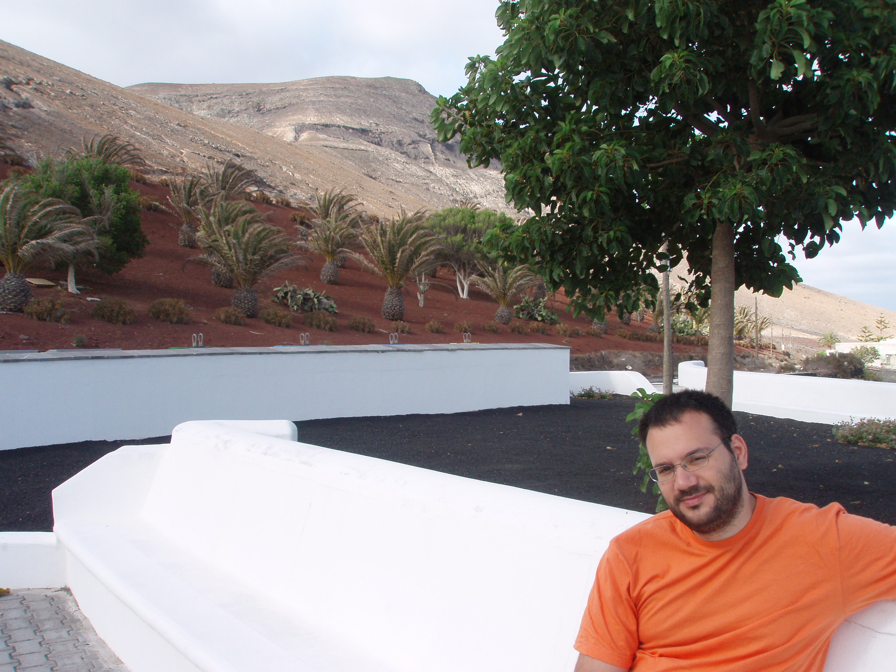

# Juan Rodríguez Hortalá

## About

[LinkedIn profile](https://www.linkedin.com/in/juan-rodriguez-hortala/)  
[Github profile](https://github.com/juanrh) 

### Coding

- [sscheck](https://github.com/juanrh/sscheck) is a Scala library that defines a DSL for temporal logic formulas for writing ScalaCheck properties and generators for testing Spark Streaming programs.
  - [Flink Check](https://github.com/demiourgoi/flink-check) is an extension of sscheck to support Flink streaming programs
- [Contributions to open source projects](https://github.com/search?q=juan+hortala&type=Commits): Apache Spark, Apache YARN, Apache Hive, Robot Operating System (Java, C++, Python, Scala)
- [cdk8s-helm-plugin](https://github.com/juanrh/cdk8s-helm-plugin/blob/main/cdk8s_plugin/cdk8s/README.md#Demo): A simple [Helm plugin](https://helm.sh/docs/topics/plugins/) that serves as a proof of concept for an integration of the [cdk8s](https://cdk8s.io/) infrastructure as code library for Kubernetes into the [Helm](https://helm.sh/) package manager for Kubernetes. It allows to distribute cdk8s charts through OCI image registries, and install cdk8s charts as Helm releases, which allows using the release management and rollback capabilities of Helm for cdk8s charts.
- [TemperatureMetrics](https://github.com/juanrh/TemperatureMetrics): a simple Python deamon that sends temperature and humidity metrics collected with a Raspberry Pi and [GrovePi+](https://wiki.seeedstudio.com/GrovePi_Plus/) sensors to AWS CloudWatch, to build a metrics dashboard on top of that.

### Research publications

- [DBLP](https://dblp.uni-trier.de/pers/hd/r/Rodr=iacute=guez=Hortal=aacute=:Juan.html)
- [Research gate](https://www.researchgate.net/profile/Juan_Rodriguez-Hortala)
- [Google Scholar](https://scholar.google.es/citations?user=6VJZpAQAAAAJ&hl=en&authuser=1&oi=sra)
- [ORCID ID 0000-0002-5822-8740](https://orcid.org/0000-0002-5822-8740)

### Patents

- [Automated software verification service](https://patents.google.com/patent/US11232015B2/en?inventor=juan+rodriguez+hortala)
- [Constraint solver execution service and infrastructure therefor](https://patents.google.com/patent/US10977111B2/en?inventor=juan+rodriguez+hortala) 
- [Automatically generating a machine-readable threat model using a template associated with an application or service](https://patents.google.com/patent/US11128653B1/en?inventor=juan+rodriguez+hortala)

---

